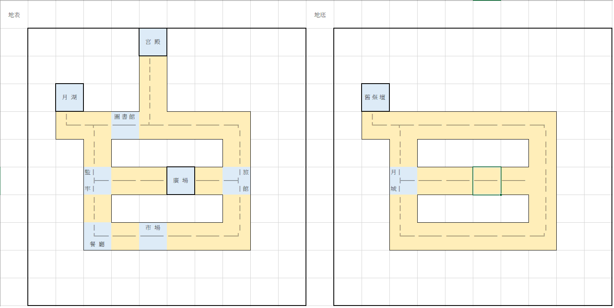

# 永晝城物語
## 遊戲說明
- 作者：曾煒傑、梁致銓、黃品瑜
- 時長：10\~12小時（跑團）、20\~30分鐘（遊戲）
- 難度：4/5（重Role Play）
- 推薦技能：御三家（偵查、聆聽、圖書館使用）
- 玩家職業：考古學家、神祕學家或記者等合理前往考古地點之職業
- 地點：1920英國
-  
## 劇情背景
一日調查員們聽說了英國出現能夠證明亞瑟王傳奇的遺址，而他們身為考古學領域中的翹楚被聘請去探索這個遺跡的真實性，而這個遺跡確實是亞瑟王時代留下的，但卻是邪神的祭壇，與神話紀載不同的是梅林並不是賢者而是一位格拉基的信徒，他謀劃了一切，從亞瑟王的出身到眾叛親離的終末，為的就只是為格拉基創造一個夢境神國，眾叛親離的亞瑟聽取了梅林的諫言，紅龍的血脈成為夢境的地基，他的王權與迷茫的內心成為了格拉基最佳的養料，而這夢境神國平和的運行直到調查員的出現。
## 角色介紹
- 約翰(Johann)
  -  <table>
     <tr>
        <th align="center">約翰(Johann)</th><th colspan="13" align="center">基礎數據</th>
     </tr>
     <tr>
         <td align="center">能力</td><td align="center">STR</td><td align="center">DEX</td><td align="center">INT</td><td align="center">CON</td><td                align="center">APP</td><td align="center">POW</td><td align="center">SIZ</td><td align="center">SAN</td><td align="center">EDU</td><td     
         align="center">Luck</td><td align="center">HP</td><td align="center">MP</td><td align="center">DB</td>
     </tr>
     <tr>
        <td align="center">數值</td><td align="center">65</td><td align="center">70</td><td align="center">50</td><td align="center">50</td><td                     align="center">40</td><td align="center">40</td><td align="center">40</td><td align="center">40</td><td align="center">40</td><td     
        align="center">50</td><td align="center">9</td><td align="center">8</td><td align="center">1D4</td>
     </tr>
     </table>
  - 一位30出頭的男性，有著一頭金色的雜亂中長髮，是此行的司機，也就是官方派來帶領調查員前往遺跡的導遊，他是一個熱情健談的人，喜歡與人聊天，他的夢想是成為一名唱作家，在車子的副駕放了一把 
    吉他，沒事時會拿起來彈，來接這次如此偏遠的載客工作就是因為想多賺點錢來完成夢想。
- 高文gawain(導遊瓦格恩 Wagain)

